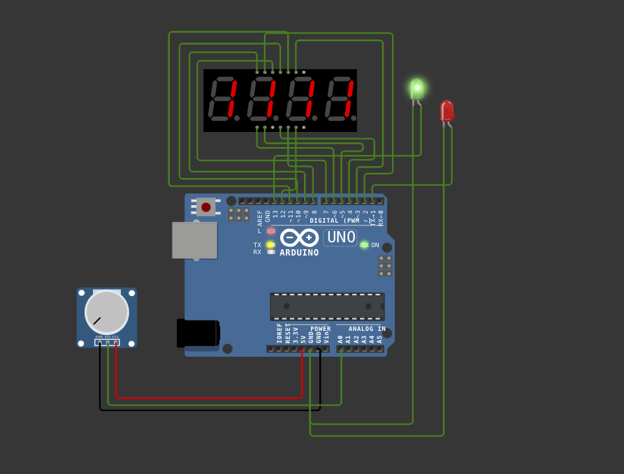

# Byte auf Display darstellen

##### Praktikumsaufgabe GTI SS2025 | TH Köln



> [!NOTE]
> Dieses Repo ist ein inoffizielles Projekt mit dem Ziel, die lokale die Bearbeitung dieser Praktikumsaufgabe mit Wokwi und PlatformIO so einfach wie möglich zu gestalten. Basierend auf dem [Original-Projekt in Wokwi][1].

[1]: https://wokwi.com/projects/399199668591202305

> [!IMPORTANT]
> Diese Seite hilft Ihnen, dieses Projekt lokal einzurichten. Klicken Sie hier um direkt **[zum 📝 Aufgabenblatt zu gelangen][2].**

[2]: AUFGABE.md

### 📋 Inhaltsverzeichnis

- [Voraussetzungen](#voraussetzungen)
- [Projekt lokal einrichten](#computer-projekt-lokal-einrichten)
  - [Option 1: ZIP-Download](#option-1-zip-download)
  - [Option 2: Git Clone](#option-2-git-clone)
- [Projekt ausführen](#gear-projekt-ausführen)
  - [Mit Wokwi-Simulator (empfohlen)](#mit-wokwi-simulator)
  - [Mit Arduino](#mit-arduino-uno-vorkonfiguriert)
  - [Mit anderem µC](#mit-anderem-mikrocontroller)

## Voraussetzungen

- VS Code installiert
- PlatformIO Extension für VS Code.[^1]
- Wokwi Extension für VS Code.[^2]

## :computer: Projekt lokal einrichten

Sie haben zwei Möglichkeiten, dieses Projekt auf Ihrem Computer zu verwenden:

### Option 1: ZIP-Download

(Einfach - empfohlen für Anfänger)

1. Klicke auf den grünen **"Code" Button** oben auf dieser [Seite](#top)

   

2. Wähle **"Download ZIP"** aus dem Dropdown-Menü

   

3. **Entpacke die ZIP-Datei** in einen Ordner deiner Wahl
4. **Öffne VS Code** und wähle "File" → "Open Folder"
5. **Navigiere zu dem entpackten Ordner** und öffne ihn
6. **Weiter zum nächsten Schritt:** [Projekt bauen und ausführen](#gear-projekt-ausführen)

### Option 2: Git Clone

(Fortgeschritten - falls Sie Git bereits verwenden oder lernen möchten)
<br>
**⚠️Voraussetzungen:** Git ist auf Ihrem Computer bereits installiert<br><br>
Sie können eine lokale Kopie von diesem Projekt auf Ihrem Rechner erstellen, indem Sie dieses Repository klonen.

1. Erstelle einen **neuen, leeren Ordner** für das Projekt

2. **Ordner** in VS Code öffnen

3. **Terminal** in VS Code öffnen

4. Repository im aktuellen Ordner klonen

   Kopiere den **folgenden Terminal-Befehl** und füge ihn **in Ihrem Terminal** ein:

   ```bash
       git clone https://github.com/anonymouslearner-en/gti-lab_bytedisplay.git .
   ```

> [!CAUTION]
> Der **Punkt (.)** am Ende nicht vergessen (bedeutet "im aktuellen Ordner klonen")

## :gear: Projekt ausführen

Dieses Projekt kann auf drei Arten ausgeführt werden:

- Mit dem Wokwi-Simulator (empfohlen)
- Mit einem physischen Arduino Uno (vorkonfiguriert)
- Mit einem anderen Mikrocontroller (erfordert Anpassung an `platformio.ini`)

### Mit Wokwi-Simulator

1. Stellen Sie **das richtige Environment** sicher!
   <br>
   Klicken Sie auf das VS Code Environment unten und wählen Sie wokwi aus.
   
   
   <br>
   <br>
   <br>
   ODER: `Cmd+Shift+P` (Mac) / `Ctrl+Shift+P` (Windows) → "Pick Project Environment" eingeben und wokwi verwenden
   <br>
   

2. Das **Projekt kompilieren**

   - Klicken Sie auf das PlatformIO Icon in der Seitenleiste → "Project Tasks" → "Build"
     <br>
     
     

   - ODER nutzen Sie die Tastenkombination: `Cmd+Shift+P` (Mac) / `Ctrl+Shift+P` (Windows) → geben Sie "PlatformIO: Build" ein
     <br>
     

3. Wokwi **Simulator starten**:
   - `Cmd+Shift+P` / `Ctrl+Shift+P`
   - "Wokwi: Start Simulator" eingeben
     

### Mit Arduino Uno (vorkonfiguriert)

> [!CAUTION]
> Bei der Aufbau sind Sie selbst für die korrekte Verkabelung verantwortlich. Stellen Sie sicher, dass alle Verbindungen gemäß dem Schaltplan (`diagram.json`) korrekt hergestellt sind.

1. Schließen Sie den Arduino Uno via USB an
2. Bauen Sie die Schaltung gemäß `diagram.json` auf:

   - 7-Segment-Display: Pins 2-8 (Segmente A-G)
   - Digit-Pins: 9-12
   - LEDs: Pin 13 (grün), Pin 1 (rot)
   - Potentiometer: A0, 5V, GND

3. Stellen Sie **das richtige Environment** sicher!
   <br>
   Klicken sie auf das VS Code Environment unten und wählen uno aus.
   <br> 
   
   <br>
   <br>
   <br>
   ODER: `Cmd+Shift+P` (Mac) / `Ctrl+Shift+P` (Windows) → "Pick Project Environment" eingeben und uno verwenden

4. Das **Projekt kompilieren**

   - Klicken Sie auf das PlatformIO Icon in der Seitenleiste → "Project Tasks" → "Build"
   - ODER nutzen Sie die Tastenkombination: `Cmd+Shift+P` (Mac) / `Ctrl+Shift+P` (Windows) → geben Sie "PlatformIO: Build" ein

5. **Code auf Arduino hochladen:**

   - Klicken Sie auf das PlatformIO Icon in der Seitenleiste → "Project Tasks" → "Upload"
   - ODER nutzen Sie die Tastenkombination: `Cmd+Shift+P` (Mac) / `Ctrl+Shift+P` (Windows) → geben Sie "PlatformIO: Upload" ein

### Mit anderem Mikrocontroller

1. Öffnen Sie `platformio.ini`
2. Passen Sie die Konfiguration an:
   ```ini
   [env:IhrMicrocontroller]
   platform = IhrePlatform
   board = IhrBoard
   framework = arduino
   ```
3. Aktualisieren Sie die Pin-Zuweisungen im Code entsprechend
4. Folgen Sie dann den [Schritten 3-5 vom Abschnitt "Mit Arduino Uno"](#mit-arduino-uno-vorkonfiguriert)

> [!WARNING]
> Bei Verwendung Ihrer Hardware:
>
> - Überprüfen Sie alle Verbindungen vor dem Einschalten
> - Achten Sie auf korrekte Spannung und Polarität

[^1]: [Die PlatformIO Extension können Sie hier finden](https://marketplace.visualstudio.com/items?itemName=platformio.platformio-ide)
[^2]: [Die Wokwi Extension können Sie hier finden](https://marketplace.visualstudio.com/items?itemName=Wokwi.wokwi-vscode)

---

    [Zurück zum Anfang :arrow_up:](#top)
